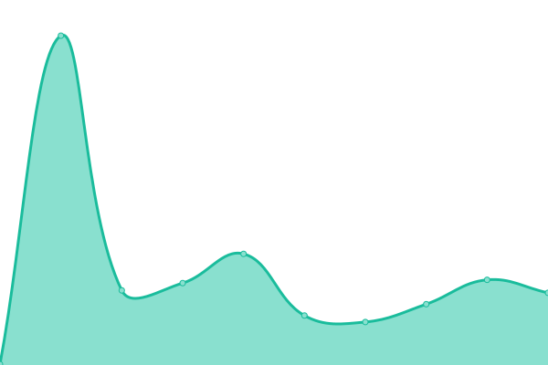

# [📈 Live Status](https://Spotflow-One.github.io/spg-status): <!--live status--> **🟧 Partial outage**

This repository contains the open-source uptime monitor and status page for [Spotflow](https://spotflow.one), powered by [Upptime](https://github.com/upptime/upptime).

With [Upptime](https://upptime.js.org), you can get your own unlimited and free uptime monitor and status page, powered entirely by a GitHub repository. We use [Issues](https://github.com/Spotflow-One/spg-status/issues) as incident reports, [Actions](https://github.com/Spotflow-One/spg-status/actions) as uptime monitors, and [Pages](https://Spotflow-One.github.io/spg-status) for the status page.

<!--start: status pages-->
<!-- This summary is generated by Upptime (https://github.com/upptime/upptime) -->
<!-- Do not edit this manually, your changes will be overwritten -->
<!-- prettier-ignore -->
| URL | Status | History | Response Time | Uptime |
| --- | ------ | ------- | ------------- | ------ |
|  [Gateway API](https://api.spotflow.co/actuator/health) | 🟩 Up | [gateway-api.yml](https://github.com/Spotflow-One/spg-status/commits/HEAD/history/gateway-api.yml) | 

 174ms
     
 | 

<a href="https://Spotflow-One.github.io/spg-status/history/gateway-api">100.00%</a>
    

|  [Checkout Service](https://checkout.spotflow.co) | 🟩 Up | [checkout-service.yml](https://github.com/Spotflow-One/spg-status/commits/HEAD/history/checkout-service.yml) | 

 102ms
     
 | 

<a href="https://Spotflow-One.github.io/spg-status/history/checkout-service">83.88%</a>
    

|  [Merchant Dashboard](https://app.spotflow.co) | 🟩 Up | [merchant-dashboard.yml](https://github.com/Spotflow-One/spg-status/commits/HEAD/history/merchant-dashboard.yml) | 

 105ms
     
 | 

<a href="https://Spotflow-One.github.io/spg-status/history/merchant-dashboard">100.00%</a>
    

|  [Documentation](https://docs.spotflow.co) | 🟩 Up | [documentation.yml](https://github.com/Spotflow-One/spg-status/commits/HEAD/history/documentation.yml) | 

 104ms
     
 | 

<a href="https://Spotflow-One.github.io/spg-status/history/documentation">100.00%</a>
    

|  [Ledger](https://ledger-api.spotflow.co/) | 🟩 Up | [ledger.yml](https://github.com/Spotflow-One/spg-status/commits/HEAD/history/ledger.yml) | 

 63ms
     
 | 

<a href="https://Spotflow-One.github.io/spg-status/history/ledger">100.00%</a>
    

|  [Typesense](https://typesense.spotflow.co/health) | 🟥 Down | [typesense.yml](https://github.com/Spotflow-One/spg-status/commits/HEAD/history/typesense.yml) | 

 0ms
     
 | 

<a href="https://Spotflow-One.github.io/spg-status/history/typesense">78.95%</a>
    

|  [Admin API](https://admin-api.spotflow.co/api-docs) | 🟩 Up | [admin-api.yml](https://github.com/Spotflow-One/spg-status/commits/HEAD/history/admin-api.yml) | 

 202ms
     
 | 

<a href="https://Spotflow-One.github.io/spg-status/history/admin-api">100.00%</a>
    

|  [Google](https://google.com/) | 🟩 Up | [google.yml](https://github.com/Spotflow-One/spg-status/commits/HEAD/history/google.yml) | 

 132ms
     
 | 

<a href="https://Spotflow-One.github.io/spg-status/history/google">100.00%</a>
    

<!--end: status pages-->

[**Visit our status website →**](https://Spotflow-One.github.io/spg-status)

## 📄 License

- Powered by: [Upptime](https://github.com/upptime/upptime)
- Code: [MIT](./LICENSE) © [Anand Chowdhary](https://anandchowdhary.com), supported by [Pabio](https://pabio.com)
- Data in the `./history` directory: [Open Database License](https://opendatacommons.org/licenses/odbl/1-0/)
